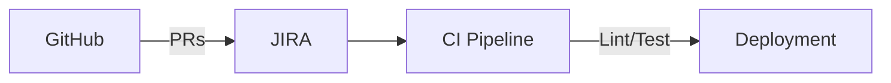
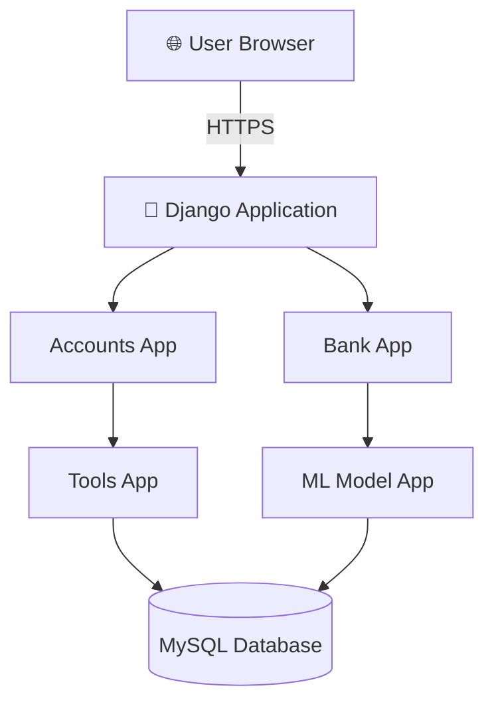
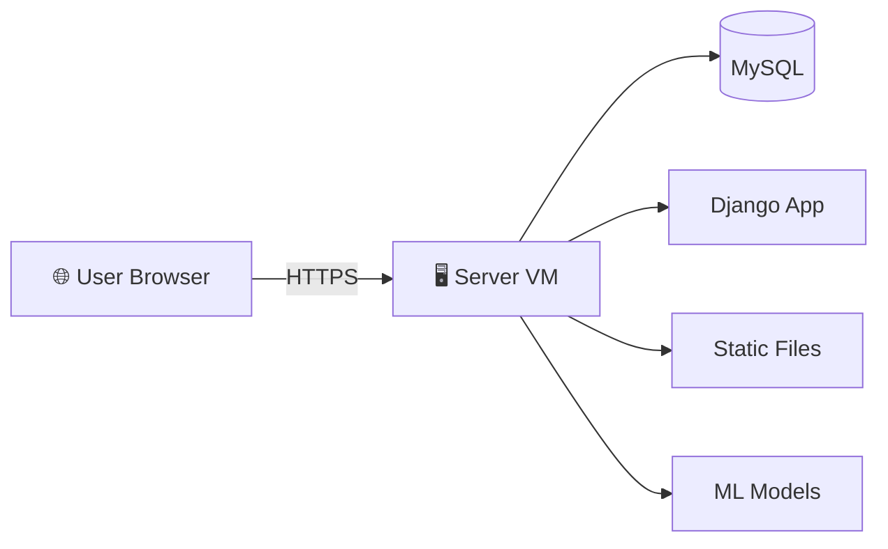
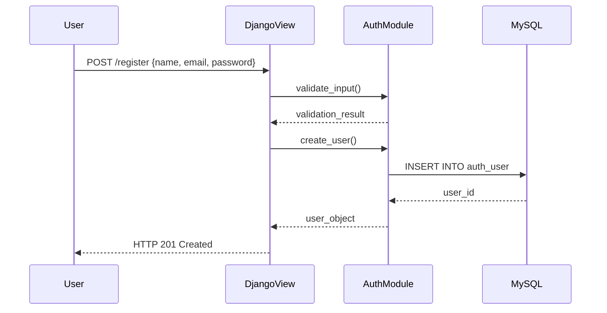
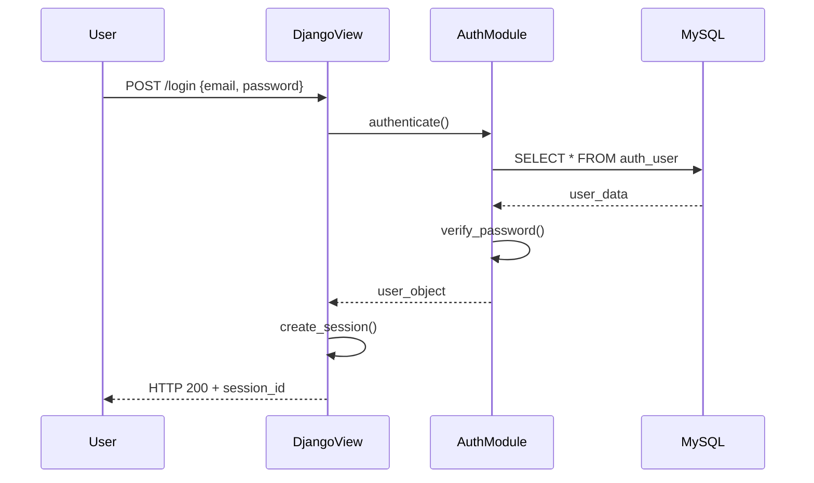
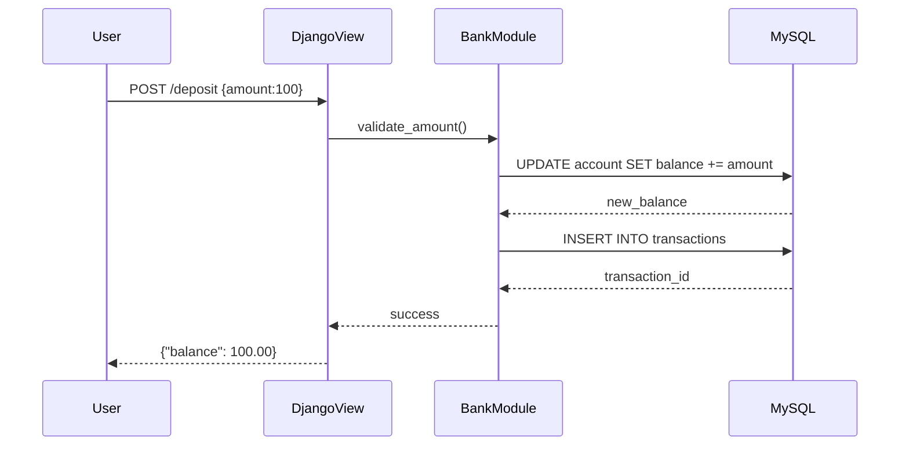
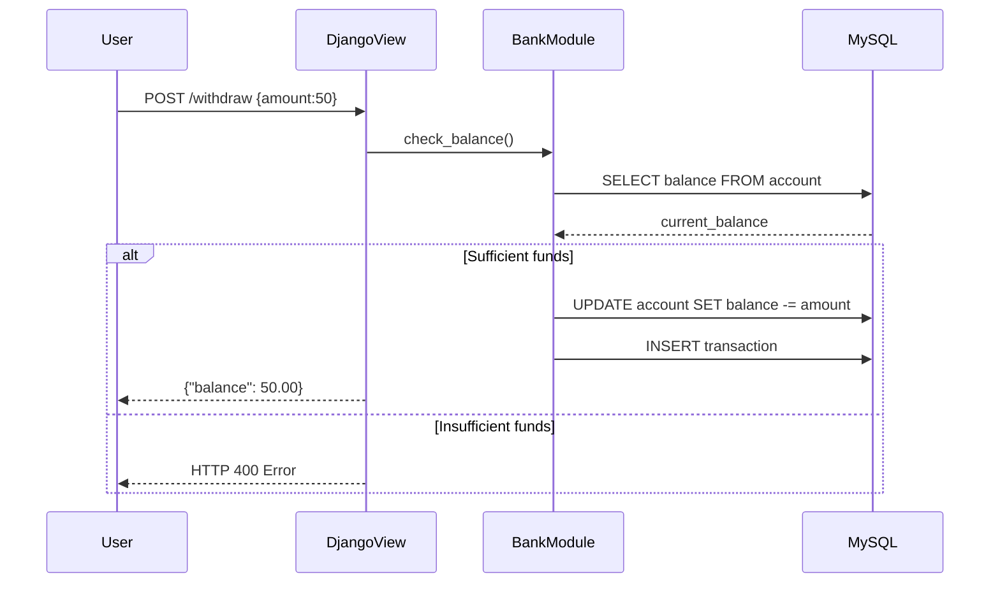
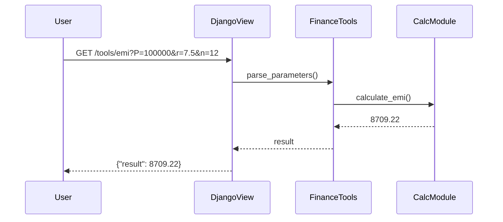
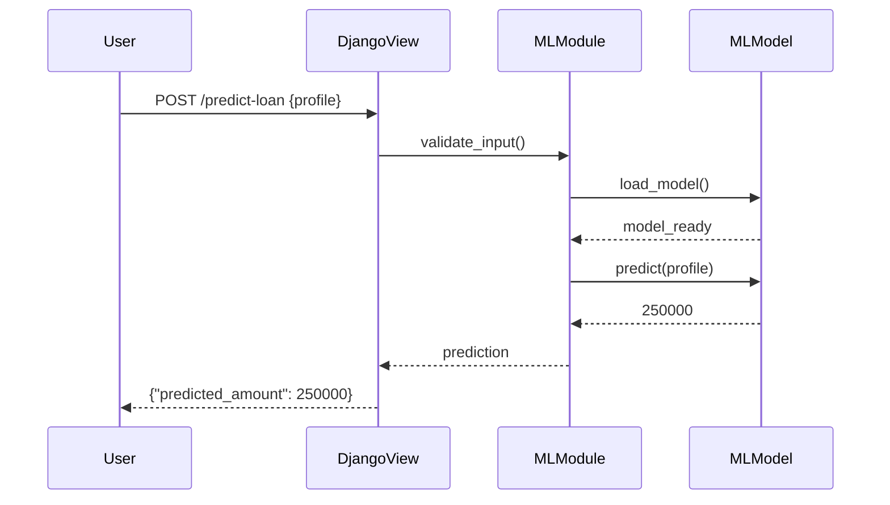

# Online Banking System with Integrated Financial Tools  
**Software Design Document (SDD)**  
*Version 1.0 | Last Updated: 2nd MAY  

## Table of Contents
1. [Introduction & Purpose](#1-introduction--purpose)  
2. [Requirements](#2-requirements)  
3. [Architecture Overview](#3-architecture-overview)  
4. [Data Flow & Sequence Diagrams & Purpose](#4-component-design)  
5. [Security Considerations](#5-security-considerations)  
6. [Deployment & Operations](#6-deployment--operations)  
7. [Testing Strategy](#7-testing-strategy)  
8. [Glossary & References](#8-glossary--references)  

## 1. Introduction & Purpose <a name="1-introduction--purpose"></a>

### 1.1 Project Overview
Web-based platform combining:
- Core banking operations (Account Management)
- 10 financial calculators (EMI, SIP, FD, etc.)
- ML-powered loan estimation

### 1.2 Purpose
| Goal | Description |
|------|-------------|
| User Empowerment | Self-service financial planning tools |
| Operational Efficiency | Unified banking & planning interface |
| Data-Driven Insights | ML-based loan eligibility prediction |

### 1.3 Scope
**In Scope**  
✅ User authentication & session management  
✅ Account operations (balance/deposit/withdraw)  
✅ Financial calculator suite  
✅ ML loan estimator endpoint  

**Future Scope**  
📈 Funds transfer between users  
📈 Multi-currency support  
📈 Mobile-native app  

## 2. Requirements <a name="2-requirements"></a>

### 2.1 Functional Requirements
**User Authentication**  
```markdown
- Endpoints:
  - `POST /api/register/` {name, email, password}
  - `POST /api/login/` {email, password}
  - `POST /api/logout/`
```

### 2.2 User Registration & Authentication
**Description**: Secure user signup/login/logout functionality

**Endpoints**:
| Method | Endpoint         | Input Parameters        | Responses               |
|--------|------------------|-------------------------|-------------------------|
| POST   | /api/register/   | {name, email, password} | 201 Created/400 BadReq  |
| POST   | /api/login/      | {email, password}       | 200 OK/401 Unauthorized |
| POST   | /api/logout/     | None                    | 204 No Content          |

**Business Rules**:
- Password hashing using PBKDF2
- Unique email validation
- Session/JWT token management

**Acceptance Criteria**:
- Clear error messages for duplicate emails
- Proper session handling for authenticated users

### 2.3 Bank Account Management
**Description**: Core banking operations for authenticated users

**Endpoints**:
| Method | Endpoint              | Input Parameters | Responses               |
|--------|-----------------------|------------------|-------------------------|
| GET    | /api/account/balance/ | None             | {balance: float}        |
| POST   | /api/account/deposit/ | {amount: float}  | New balance             |
| POST   | /api/account/withdraw/| {amount: float}  | New balance/400 BadReq  |

**Business Rules**:
- Positive transaction amounts
- Withdrawal limit ≤ current balance
- Transaction logging with timestamps

**Acceptance Criteria**:
- Atomic balance updates
- Overdraft prevention with errors

### 2.4 Personal Finance Calculators
**Description**: 10 financial planning tools with API endpoints

**Calculator Endpoints**:
```http
GET /api/tools/emi/?P={principal}&r={rate}&n={months}
GET /api/tools/sip/?m={monthly}&r={rate}&n={months}
GET /api/tools/fd/?P={principal}&r={rate}&t={years}
... (8 additional calculators)
```

**Validation Rules**:
- Non-negative numeric inputs
- Rate parameters 0-100%
- SON response format

**Acceptance Criteria**:
- <50ms response time per calculation
- Input validation errors with 400 status

### 2.5 Loan Estimation Service

Endpoint:
```
http
POST /api/predict-loan/
{
  "age": int,
  "monthly_income": float,
  "credit_score": int,
  "loan_tenure_years": int,
  "existing_loan": float,
  "dependents": int
}
```

### 2.6 Testing & Quality Assurance
**Testing Strategy**:

**Unit Tests**:
- ≥2 tests per calculator function
- Banking operation edge cases
- Authentication failure scenarios

**Integration Tests**:
- End-to-end user flows
- Cross-component interactions

**Coverage**:
- ≥80% code coverage
- CI pipeline enforcement

### 2.6 Project Workflow & Tracking
**Development Process**:


### 2.7 Non-Functional Requirements 🔧

### ⚡ Performance 
- **Calculator Functions**: < 50 ms/request under load (Speed-critical operations)
- **ML Endpoint**: < 100 ms inference time (Real-time predictions)
- **API Response**: < 200 ms (network excluded)

### 📈 Scalability
- **Stateless API Servers** behind load balancer 
- **Managed Database** with vertical/horizontal scaling (Cloud-native ready)

### 🔒 Security 
- **HTTPS Mandatory**  (TLS 1.3+ enforced)
- **Auth**: Django sessions/JWT with CSRF protection
- **Input Sanitization** (XSS/SQLi protection)
- **Data Protection**: PBKDF2 hashing + log masking 

### ♿ Usability & Accessibility
- **Responsive UI**  (Bootstrap 5 grids)
- **Form Validation** with clear errors 
- **WCAG 2.1** compliance (keyboard nav + screen reader support)

### 🧰 Maintainability
- **PEP8 Compliance** (flake8 enforced)
- **Modular Architecture** (Auth | Banking | Tools | ML apps)
- **Documentation**: Docstrings + inline comments (70% coverage)

### 🚨 Reliability & Availability
- **99.5% Uptime SLA** (24/7 monitoring)
- **Auto-Healing**: Health checks + restart policies
- **Disaster Recovery**: Daily backups

### 📋 Audit & Logging
- **Critical Ops Logged** (Auth events, Transactions, Predictions)
- **Centralized Logging** (ELK Stack/CloudWatch)
- **7-Year Retention** (GDPR compliant)

## 3. Architecture Overview & Purpose <a name="3-architecture-overview"></a>

### 3.1 System Context 


### 3.2 Technology Stack 🛠️
| Layer                | Technology             | Rationale                          |
|----------------------|------------------------|------------------------------------|
| **Language & Framework** | Python 3.9+ & Django 4 | Built-in ORM & Auth          |
| **Database**         | MySQL                  | ACID Compliance            |
| **Frontend**         | Bootstrap 5            | Responsive UI                 |
| **ML Library**       | scikit-learn/XGBoost   | Proven regression models     |
| **Testing**          | pytest                 | Modern testing framework      |
| **Version Control**  | Git + GitHub           | Industry standard PR workflow |

---

### 3.3 Folder Structure 📂

```bash
project_root/
├── manage.py
├── requirements.txt
├── README.md
├── .gitignore
├── accounts/          # Auth core 🔐
├── bank/              # Banking ops 💳
├── tools/             # Calculators 🧮
├── ml_model/          # AI models 🤖
├── templates/         # UI components 🎨
├── static/            # CSS/JS assets 🖌️
└── tests/             # Testing 
```

### 3.5 Deployment Topology 


## 4. Data Flow & Sequence Diagrams & Purpose <a name="4-component-design"></a>

### 4.1 User Registration

### 4.2 User Login

### 4.3 Deposit Funds


### 4.4 Withdraw Funds


### 4.5 EMI Calculator


### 4.6 Loan Amount Prediction


## 5. Security Considerations (Detailed) & Purpose <a name="5-security-considerations"></a> 

A robust security posture is essential for any banking application. Below is an expanded breakdown of each security domain, including implementation notes and sample configurations.

### 5.1 Authentication  
- **Mechanism:** Django’s built-in session framework  
- **Implementation:**  
  - Enable `django.contrib.auth` in `INSTALLED_APPS`.  
  - Use `LOGIN_URL` and `LOGIN_REDIRECT_URL` in `settings.py`.  
  - Enforce strong passwords via `AUTH_PASSWORD_VALIDATORS`:  
    ```python
    AUTH_PASSWORD_VALIDATORS = [
        {'NAME': 'django.contrib.auth.password_validation.UserAttributeSimilarityValidator'},
        {'NAME': 'django.contrib.auth.password_validation.MinimumLengthValidator', 'OPTIONS': {'min_length': 8}},
        {'NAME': 'django.contrib.auth.password_validation.CommonPasswordValidator'},
        {'NAME': 'django.contrib.auth.password_validation.NumericPasswordValidator'},
    ]
    ```  
  - **CSRF Protection:**  
    - Ensure `django.middleware.csrf.CsrfViewMiddleware` is enabled.  
    - Decorate any view modifying state with `@csrf_protect` or use `` in templates.
      
### 5.2 Authorization  
- **Requirement:** Only authenticated users can access banking and tools endpoints.  
- **Implementation:**  
  - Use `@login_required` on all class- and function-based views:  
    ```python
    from django.contrib.auth.decorators import login_required

    @login_required
    def deposit_view(request):
        ...
    ```  
  - For DRF endpoints, set default permission classes:  
    ```python
    REST_FRAMEWORK = {
        'DEFAULT_PERMISSION_CLASSES': [
            'rest_framework.permissions.IsAuthenticated',
        ],
    }
    ```  
  - **Object-Level Checks:**  
    - Confirm that, e.g., `Account.objects.get(user=request.user)` never leaks another user’s data.  

### 5.3 Input Validation & Sanitization  
- **Sanitize All Inputs:** Never trust user-supplied data.  
- **Implementation:**  
  - **Django Forms / DRF Serializers:**  
    ```python
    from django import forms

    class DepositForm(forms.Form):
        amount = forms.DecimalField(min_value=0.01, max_digits=12, decimal_places=2)
    ```  
  - **Manual Validation in Views:**  
    ```python
    try:
        amt = Decimal(request.POST['amount'])
        if amt <= 0:
            raise ValueError
    except (KeyError, InvalidOperation, ValueError):
        return JsonResponse({'error': 'Invalid amount'}, status=400)
    ```  
  - **HTML Escaping:**  
    - Use Django template auto-escaping to prevent XSS.  
    - For any rich text inputs, apply a library like `bleach` to whitelist allowed tags. 

### 5.4 Encryption & Data Protection  
- **Transport Security:**  
  - **HTTPS Only:**  
    ```python
    SECURE_SSL_REDIRECT = True
    SESSION_COOKIE_SECURE = True
    CSRF_COOKIE_SECURE = True
    ```  
  - **HSTS:**  
    ```python
    SECURE_HSTS_SECONDS = 31536000
    SECURE_HSTS_INCLUDE_SUBDOMAINS = True
    SECURE_HSTS_PRELOAD = True
    ```  
- **Password Storage:**  
  - Django’s default PBKDF2-SHA256 hasher.  
  - Rotate to stronger algorithms (e.g., Argon2) by installing `django-argon2`.  
- **Secrets Management:**  
  - Store `SECRET_KEY`, database credentials, and other secrets in environment variables or a `.env` file loaded via `django-environ` or `python-decouple`.  

### 5.5 Threat Mitigation  
- **Rate Limiting:**  
  - Use `django-ratelimit` to throttle login attempts:  
    ```python
    from ratelimit.decorators import ratelimit

    @ratelimit(key='ip', rate='5/m', block=True)
    def login_view(request):
        ...
    ```  
- **SQL Injection Prevention:**  
  - Always use Django ORM (`.filter()`, `.get()`) rather than raw SQL.  
- **Cross-Site Scripting (XSS):**  
  - Rely on Django’s auto-escaping in templates.  
  - Validate or strip any HTML in user-generated content.  
- **Cross-Site Request Forgery (CSRF):**  
  - Ensure CSRF middleware is enabled.  
  - Include `` in all POST forms or AJAX headers.  

---

### 5.6 Logging & Audit  
- **Critical Events to Log:**  
  - Successful & failed logins  
  - Deposit and withdrawal transactions  
  - Loan prediction requests (with input hash, not raw data)  
- **Configuration (`settings.py`):**  
  ```python
  LOGGING = {
      'version': 1,
      'handlers': {
          'file': {
              'level': 'INFO',
              'class': 'logging.handlers.RotatingFileHandler',
              'filename': '/var/log/mybank/app.log',
              'maxBytes': 1024*1024*5,
              'backupCount': 5,
          },
      },
      'loggers': {
          'django': {'handlers': ['file'], 'level': 'INFO', 'propagate': True},
          'bank':   {'handlers': ['file'], 'level': 'INFO', 'propagate': False},
          'tools':  {'handlers': ['file'], 'level': 'INFO', 'propagate': False},
          'ml_model':{'handlers':['file'], 'level':'INFO','propagate':False},
      },
  }
  ```  
- **Audit Trails:**  
  - Store transaction records with timestamps and user IDs.  
  - Optionally, implement an audit table for sensitive changes (e.g., password resets).  

### 6.7 Compliance & Best Practices  
- **Data Privacy:** Adhere to local regulations (e.g., GDPR, if applicable) by:  
  - Providing data export/deletion endpoints.  
  - Minimizing storage of personally identifiable information (PII).  
- **Periodic Reviews:**  
  - Rotate keys & credentials every 90 days.  
  - Perform vulnerability scans (e.g., with OWASP ZAP).  
  - Keep dependencies up to date via `pip-audit` or similar tools.  

## 6. Deployment & Operations (Detailed) & Purpose <a name="6-deployment--operations"></a> 

A reliable deployment and operations plan ensures your application stays up, scales with demand, and can be rolled back in case of issues—even on a simple on-premise setup. Below is a breakdown of each area with example configurations.

### 6.1 Infrastructure Setup  
- **Server OS**  
  - Ubuntu 20.04 LTS (or any modern Linux distro).  
  - Minimum 2 vCPU, 4 GB RAM, 50 GB disk for small production.  
- **Dependencies**  
  - Python 3.9+ (installed via `apt` or `pyenv`).  
  - MySQL 8 server (configured with a dedicated DB/user for the app).  
  - Virtualenv (`python3 -m venv /opt/mybank/venv`).  

### 6.2 Application Deployment  
#### 6.2.1 Virtual Environment & Requirements  
```bash
# Create and activate venv
python3 -m venv /opt/mybank/venv
source /opt/mybank/venv/bin/activate

# Install dependencies
pip install --upgrade pip
pip install -r /opt/mybank/project_root/requirements.txt
```

#### 6.2.2 Static Files  
- Use Django’s **WhiteNoise** to serve static assets without Nginx:  
  ```python
  # settings.py
  INSTALLED_APPS += ['whitenoise.runserver_nostatic']
  MIDDLEWARE = ['whitenoise.middleware.WhiteNoiseMiddleware'] + MIDDLEWARE
  STATIC_ROOT = BASE_DIR / 'staticfiles'
  ```
- Collect static files:  
  ```bash
  python manage.py collectstatic --noinput
  ```

#### 6.2.3 WSGI Server (Gunicorn) + systemd  
**File:** `/etc/systemd/system/mybank.service`  
```ini
[Unit]
Description=Gunicorn for MyBanking
After=network.target

[Service]
User=www-data
Group=www-data
WorkingDirectory=/opt/mybank/project_root
Environment="PATH=/opt/mybank/venv/bin"
ExecStart=/opt/mybank/venv/bin/gunicorn \
    --workers 3 \
    --bind 127.0.0.1:8000 \
    project_name.wsgi:application

Restart=on-failure
RestartSec=5

[Install]
WantedBy=multi-user.target
```
```bash
sudo systemctl daemon-reload
sudo systemctl enable mybank
sudo systemctl start mybank
```

### 6.3 Database Migrations & Backups  
- **Migrations**  
  - As part of deployment, run:  
    ```bash
    source /opt/mybank/venv/bin/activate
    python manage.py migrate --noinput
    ```
- **Automated Backups**  
  - **Cron job** (e.g., `/etc/cron.d/mysql_backup`):  
    ```cron
    0 2 * * * root mysqldump -u db_user -p'secure_pass' mybank_db | gzip > /backups/mybank_db_$(date +\%F).sql.gz
    ```
  - Retain backups for 14 days and purge older files via another daily cron.

### 6.4 CI/CD Pipeline  
Use **GitHub Actions** to lint, test, and deploy on `main` merge.

**File:** `.github/workflows/ci-cd.yml`  
```yaml
name: CI/CD

on:
  push:
    branches: [ main ]

jobs:
  lint-test:
    runs-on: ubuntu-latest
    steps:
      - uses: actions/checkout@v3
      - name: Setup Python
        uses: actions/setup-python@v4
        with: python-version: '3.9'
      - name: Install dependencies
        run: |
          python -m venv venv
          source venv/bin/activate
          pip install -r requirements.txt
      - name: Lint with flake8
        run: |
          source venv/bin/activate
          flake8 .
      - name: Run tests
        run: |
          source venv/bin/activate
          coverage run manage.py test
          coverage report --fail-under=80

  deploy:
    needs: lint-test
    runs-on: ubuntu-latest
    if: github.ref == 'refs/heads/main'
    steps:
      - uses: actions/checkout@v3
      - name: Deploy via SSH
        uses: appleboy/ssh-action@v0.1.6
        with:
          host: ${{ secrets.SERVER_HOST }}
          username: ${{ secrets.SERVER_USER }}
          key: ${{ secrets.SERVER_SSH_KEY }}
          script: |
            cd /opt/mybank/project_root
            git pull origin main
            source /opt/mybank/venv/bin/activate
            pip install -r requirements.txt
            python manage.py migrate --noinput
            python manage.py collectstatic --noinput
            sudo systemctl restart mybank
```

### 6.5 Monitoring & Alerts  
- **Health Check Endpoint:**  
  - Create `/health/` view returning 200 if DB & cache are reachable.  
- **Cron-Based Uptime Check:**  
  ```bash
  # /usr/local/bin/check_health.sh
  if ! curl -fsS https://your.domain.com/health/; then
    echo "Health check failed" | mail -s "MyBank Down" ops@example.com
  fi
  ```
  ```cron
  */5 * * * * root /usr/local/bin/check_health.sh
  ```
- **Error Reporting:**  
  - Integrate **Sentry**:  
    ```python
    # settings.py
    import sentry_sdk
    from sentry_sdk.integrations.django import DjangoIntegration

    sentry_sdk.init(
      dsn=os.environ.get('SENTRY_DSN'),
      integrations=[DjangoIntegration()],
      traces_sample_rate=0.1,
      send_default_pii=True
    )
    ```

### 6.6 Rollout & Rollback Strategy  
- **Rollout:**  
  - Deploy to a staging server first (same steps), run smoke tests, then merge to `main`.  
- **Rollback:**  
  - On failure, SSH into the server:  
    ```bash
    cd /opt/mybank/project_root
    git reset --hard HEAD@{1}
    sudo systemctl restart mybank
    ```
  - Optionally restore previous DB backup if migrations were destructive.

## 7. Testing Strategy (Local Development, `unittest`-Based) & Purpose <a name="7-testing-strategy"></a>

To maintain code quality and catch regressions early, we’ll use Django’s built-in `unittest` framework for all testing. Tests run against a local SQLite database by default, isolating them from any production data.

### 7.1 Overview  
- **Objectives:**  
  1. **Unit Tests** for pure Python logic (finance calculators, helper functions).  
  2. **Django Tests** (`django.test.TestCase`) for views, URLs, models, and permissions.  
  3. **Integration Tests** combining multiple components end-to-end.  
  4. **Coverage Enforcement**: ≥ 80% line coverage.  

### 7.2 Unit Tests for Pure Functions  
**Location:** `tools/tests.py`, `ml_model/tests.py`, and any helper modules.  
**Pattern:** subclass `unittest.TestCase`.

```python
# tools/tests.py
import unittest
from tools.finance_tools import calculate_emi, calculate_fd, calculate_sip

class FinanceToolsUnitTests(unittest.TestCase):
    def test_calculate_emi_standard(self):
        # Known EMI for P=100000, r=7.5%, n=12
        emi = calculate_emi(100000, 7.5, 12)
        self.assertAlmostEqual(emi, 8709.22, places=2)

    def test_calculate_emi_zero_principal(self):
        self.assertEqual(calculate_emi(0, 5, 12), 0.0)

    def test_calculate_sip_edge(self):
        # Zero monthly investment yields zero
        self.assertEqual(calculate_sip(0, 8, 12), 0.0)

    def test_calculate_fd_compound(self):
        fd = calculate_fd(5000, 6, 2)  # P=5000, r=6%, t=2
        self.assertAlmostEqual(fd, 5618.00, places=2)
```
### 7.3 Django-Specific Tests  
Use `django.test.TestCase` (which wraps `unittest.TestCase`) and the test **Client** to simulate requests.

#### 7.3.1 Authentication Tests  
```python
# accounts/tests.py
from django.test import TestCase
from django.urls import reverse
from django.contrib.auth import get_user_model

User = get_user_model()

class AuthTests(TestCase):
    def setUp(self):
        self.register_url = reverse('accounts:register')
        self.login_url = reverse('accounts:login')
        self.logout_url = reverse('accounts:logout')
        self.user_data = {
            'username': 'alice',
            'email': 'alice@example.com',
            'password': 'ComplexP@ss123'
        }

    def test_register_success(self):
        resp = self.client.post(self.register_url, self.user_data)
        self.assertEqual(resp.status_code, 201)
        self.assertTrue(User.objects.filter(email='alice@example.com').exists())

    def test_register_duplicate_email(self):
        User.objects.create_user(**self.user_data)
        resp = self.client.post(self.register_url, self.user_data)
        self.assertEqual(resp.status_code, 400)
        self.assertIn('error', resp.json())

    def test_login_logout_flow(self):
        User.objects.create_user(**self.user_data)
        resp = self.client.post(self.login_url, {
            'email': 'alice@example.com',
            'password': 'ComplexP@ss123'
        })
        self.assertEqual(resp.status_code, 200)
        # Check session created
        self.assertIn('_auth_user_id', self.client.session)

        resp = self.client.post(self.logout_url)
        self.assertEqual(resp.status_code, 204)
        self.assertNotIn('_auth_user_id', self.client.session)
```

#### 7.3.2 Banking Tests  
```python
# bank/tests.py
from django.test import TestCase
from django.urls import reverse
from django.contrib.auth import get_user_model
from bank.models import Account

User = get_user_model()

class BankTests(TestCase):
    def setUp(self):
        # Create and log in a user
        self.user = User.objects.create_user(username='bob', email='bob@example.com', password='Pwd12345')
        self.client.login(username='bob', password='Pwd12345')
        # Ensure account exists
        self.account = Account.objects.create(user=self.user, balance=100.00)
        self.balance_url = reverse('bank:balance')
        self.deposit_url = reverse('bank:deposit')
        self.withdraw_url = reverse('bank:withdraw')

    def test_balance_view(self):
        resp = self.client.get(self.balance_url)
        self.assertEqual(resp.status_code, 200)
        self.assertEqual(resp.json()['balance'], 100.00)

    def test_deposit_success(self):
        resp = self.client.post(self.deposit_url, {'amount': '50.00'}, content_type='application/json')
        self.assertEqual(resp.status_code, 200)
        self.account.refresh_from_db()
        self.assertEqual(self.account.balance, 150.00)

    def test_withdraw_success(self):
        resp = self.client.post(self.withdraw_url, {'amount': '40.00'}, content_type='application/json')
        self.assertEqual(resp.status_code, 200)
        self.account.refresh_from_db()
        self.assertEqual(self.account.balance, 60.00)

    def test_withdraw_insufficient(self):
        resp = self.client.post(self.withdraw_url, {'amount': '150.00'}, content_type='application/json')
        self.assertEqual(resp.status_code, 400)
        self.assertIn('error', resp.json())
        self.account.refresh_from_db()
        self.assertEqual(self.account.balance, 100.00)
```

#### 7.3.3 Finance Tools Endpoint Tests  
```python
# tools/tests.py (continued)
from django.urls import reverse
from django.test import TestCase

class ToolsEndpointTests(TestCase):
    def setUp(self):
        self.emi_url = reverse('tools:emi')
        self.sip_url = reverse('tools:sip')

    def test_emi_endpoint_valid(self):
        resp = self.client.get(self.emi_url, {'P':'100000','r':'7.5','n':'12'})
        self.assertEqual(resp.status_code, 200)
        self.assertIn('result', resp.json())

    def test_emi_endpoint_invalid_param(self):
        resp = self.client.get(self.emi_url, {'P':'abc','r':'7.5','n':'12'})
        self.assertEqual(resp.status_code, 400)
```

### 7.4 Integration Tests  
Combine registration, banking, and a calculator in one flow.

```python
# tests/test_end_to_end.py
from django.test import TestCase
from django.urls import reverse
from django.contrib.auth import get_user_model

User = get_user_model()

class EndToEndTest(TestCase):
    def test_full_user_journey(self):
        # Register
        reg = self.client.post(reverse('accounts:register'), {
            'username':'carol','email':'carol@example.com','password':'Secret123'
        })
        self.assertEqual(reg.status_code, 201)

        # Login
        login = self.client.post(reverse('accounts:login'), {
            'email':'carol@example.com','password':'Secret123'
        })
        self.assertEqual(login.status_code, 200)

        # Deposit
        dep = self.client.post(reverse('bank:deposit'), {'amount':'200'}, content_type='application/json')
        self.assertEqual(dep.status_code, 200)
        self.assertEqual(dep.json()['balance'], 200.00)

        # EMI calculator
        emi = self.client.get(reverse('tools:emi'), {'P':'50000','r':'6','n':'10'})
        self.assertEqual(emi.status_code, 200)
        self.assertTrue(isinstance(emi.json()['result'], float))
```

### 7.5 Running Tests Locally  
1. **Activate your virtualenv**:  
   ```bash
   source /opt/mybank/venv/bin/activate
   ```  
2. **Run all tests via Django**:  
   ```bash
   python manage.py test
   ```  
3. **View Coverage**:  
   ```bash
   pip install coverage
   coverage run --source='.' manage.py test
   coverage report --fail-under=80
   coverage html  # open htmlcov/index.html in browser
   ```

### 7.6 Fixtures & Test Data  
- **Django Fixtures:** place JSON/YAML in `accounts/fixtures/` and load via:  
  ```bash
  python manage.py loaddata accounts/fixtures/users.json
  ```  
- **`setUp()` / `tearDown()`** in each `TestCase` ensures a fresh database per test class.


## 8. Glossary & References & Purpose <a name="8-glossary--references"></a>

### 8.1 Glossary of Terms 📚

### 📈 Financial & Investment Terms
- **EMI (Equated Monthly Installment)**  
  Fixed monthly loan payment calculated as:  
  ```math
  \text{EMI} = P \times \frac{r(1 + r)^n}{(1 + r)^n - 1}
  ```
  Where:  
  `P` = Principal, `r` = Monthly interest rate, `n` = Total months

- **SIP (Systematic Investment Plan)**  
  Regular mutual fund investments with rupee cost averaging benefits 💹

- **FD (Fixed Deposit)**  
  Lump-sum investment with compound interest:  
  ```math
  \text{Maturity} = P \times (1 + \tfrac{r}{100})^t
  ```

- **RD (Recurring Deposit)**  
  Monthly savings with compound growth:  
  ```math
  M = P \times \frac{(1 + r)^{n+1} - (1 + r)}{r}
  ```

- **ROI (Return on Investment)**  
  Profitability measure:  
  ```math
  \text{ROI} = \frac{\text{Gain} - \text{Cost}}{\text{Cost}} \times 100\%
  ```

### 💻 Data & Application Terms
- **ORM (Object-Relational Mapping)** : Database-object conversion layer (e.g., Django ORM) 
- **CRUD (Create, Read, Update, Delete)** : Fundamental data operations
- **REST API** : HTTP-based resource management architecture
- **JSON** : Lightweight data interchange format {}

### 🖥️ Web & Markup Terms
- **HTML** : Web page structure language
- **CSS** : Style presentation system 

### 🔒 Security Terms
- **CSRF (Cross-Site Request Forgery)** : Unauthorized action execution 
- **XSS (Cross-Site Scripting)** : Malicious script injection 

### 🚀 DevOps & Testing
- **CI/CD** : Automated build-test-deploy pipeline 
- **Unit Test** : Isolated code verification 
- **Code Coverage** : Test completeness metric (≥80% enforced)

### 🤖 Machine Learning
- **ML** : Pattern learning from data 
- **Regression Model** : Continuous value predictor

## 8.2 References 📖

### Core Documentation
- [Django 4.2 Documentation](https://docs.djangoproject.com/en/4.2/) - Auth, ORM, testing
- [MySQL 8 Reference](https://dev.mysql.com/doc/refman/8.0/en/) - Database setup
- [Bootstrap 5 Docs](https://getbootstrap.com/docs/5.0/) - UI components

### Development Resources
- [scikit-learn Guide](https://scikit-learn.org/stable/user_guide.html) - ML models
- [Python unittest](https://docs.python.org/3/library/unittest.html) - Testing framework
- [PEP 8 Style Guide](https://peps.python.org/pep-0008/) - Code formatting

### Security
- [OWASP Cheat Sheets](https://cheatsheetseries.owasp.org/) - Web security best practices
- [Django Environ](https://github.com/joke2k/django-environ) - Environment management
